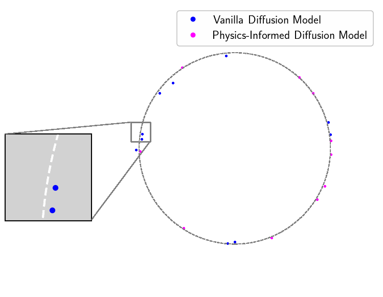

:tada: **News** (2025.01) PIDM has been accepted at ICLR 2025 - see you in Singapore!

<h1 align="center">Physics-Informed Diffusion Models (ICLR 2025)</h1>
<h4 align="center">
<a href="https://arxiv.org/abs/2403.14404"></a>
</h4>
<div align="center">
  <span class="author-block">
    <a>Jan-Hendrik Bastek</a><sup>1</sup>,</span>
  <span class="author-block">
    <a>WaiChing Sun</a><sup>2</sup> and</span>
  <span class="author-block">
    <a>Dennis M. Kochmann</a><sup>1</sup></span>
</div>
<div align="center">
  <span class="author-block"><sup>1</sup>ETH Zurich,</span>
  <span class="author-block"><sup>2</sup>Columbia University</span>
</div>

$~$
<p align="center"></p>

## Introduction & Setup
We introduce a framework to inform diffusion models of constraints generated samples must adhere to during model training, as presented in [Physics-Informed Diffusion Models](https://arxiv.org/abs/2403.14404).
To conduct similar studies as those presented in the preprint, start by cloning this repository via
```
git clone https://github.com/jhbastek/PhysicsInformedDiffusionModels.git
```
We provide three scripts:

`main_toy.py` reproduces the toy study presented in Appendix F.1. It is helpful to understand the implications of the PIDM loss and several variants. Simply change the config file and run the script to reproduce the results or experiment with different parameters.

To reproduce the results for the Darcy flow and topology optimization study, you will first have to download the data and pretrained models from the [ETHZ Research Collection](https://doi.org/10.3929/ethz-b-000674074) and place them (unzipped) as follows:
```
.
├── data
│   ├── darcy
│   │   └── ...
│   └── mechanics
│       └── ...
└── trained_models
    ├── darcy
    │   └── ...
    └── mechanics
        └── ...
```

After this, you can run the following scripts:

`main.py` reproduces the Darcy flow and topology optimization study presented in Section 4. Simply adjust the parameters and governing equations in `model.yaml` and run the script to train the models. Note that the name of the run and logging parameters can be directly adjusted in `main.py`, if necessary.

`sample.py` evaluates trained models. Provide the `directory_path`, `name`, and `load_model_step` of the model to evaluate and run the script. Note that the full evaluation of the in- and out-of-distribution test sets for the topology optimization study may take some time.

## Dependencies

The framework was developed and tested on Python 3.11 using CUDA 12.0.
To run the toy model, the following packages are required:
Package | Version (>=)
:-|:-
`pytorch`                   | `2.0.1`
`tqdm`                      | `4.65.0`
`matplotlib`                | `3.7.2`
`imageio`                   | `2.28.1`
`einops`                    | `0.6.1`
`wandb` (optional)          | `0.15.2`

To run the Darcy flow and topology optimization study, the following additional packages are required:
Package | Version (>=)
:-|:-
`findiff`                   | `0.10.0`
`solidspy`                  | `1.0.16`
`pandas`                    | `2.1.3`
`einops-exts`               | `0.0.4`
`rotary_embedding_torch`    | `0.2.3`
`torchvision`               | `0.15.2`
`opencv`                    | `4.9.0.80`

## Citation

If this code is useful for your research, please consider citing
```bibtex
@inproceedings{
bastek2025physicsinformed,
title={Physics-Informed Diffusion Models},
author={Jan-Hendrik Bastek and WaiChing Sun and Dennis Kochmann},
booktitle={The Thirteenth International Conference on Learning Representations},
year={2025},
url={https://openreview.net/forum?id=tpYeermigp}
}
